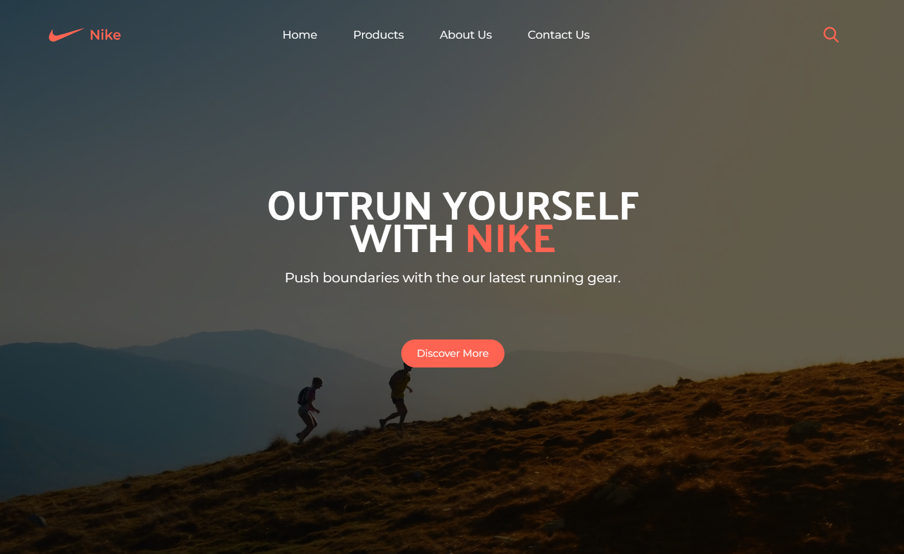

# Nike Rom

This project leverages Tailwind to craft a clean and consistent UI/UX centered around Nike products. The design approach is both simple and effective, highlighting the ease with which Tailwind aids web development. Every page on the site resonates with a cohesive orange Nike theme. I was planning to add more features to it by creating a backend and turning it into simple eCommerce but since this is just my first UI/UX-focused project, I'll just create another app for that next time. Definitely gonna study web animations next time.

Link: https://nike-rom.vercel.app



## 💡Features

- Home Page: Landing page overview of products and promotions.
- Product Page: Simple view of shoes.
- About Page: Information about Nike.
- Contact Page: Reach out for queries or feedback.

## 💻 Technologies Used

- React
- Tailwind

## 🚀 Getting Started

These instructions will help you set up the project locally, for development and testing.

### Prerequisites

- Node.js v18 above.
- npm

### Installation & Setup

1. Clone the repository:

```
git clone https://github.com/romnegrillo/nike-rom
```

2. Navigate to the project directory:

```
cd nike-rom
```

3. Install dependencies:

```
npm install
```

4. Run the development server:

```
npm run dev
```
